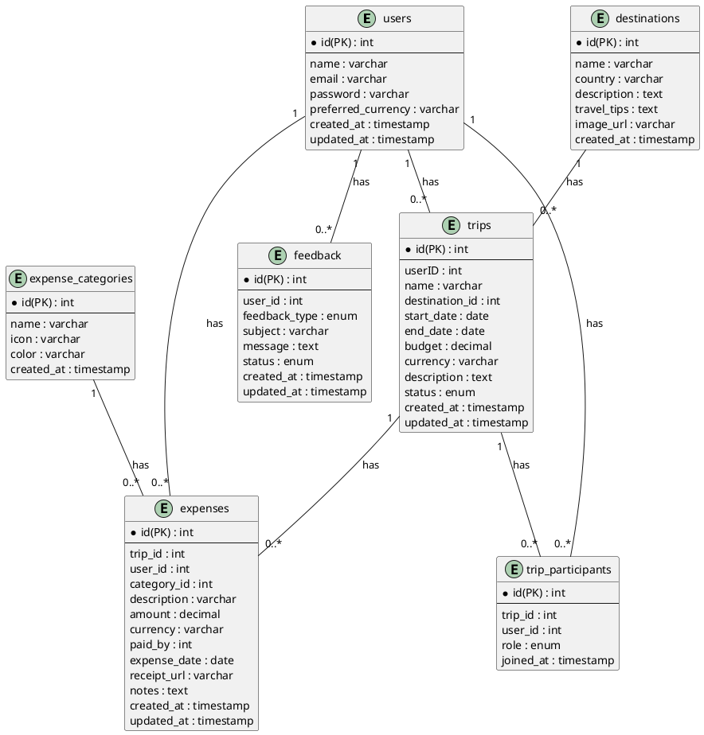
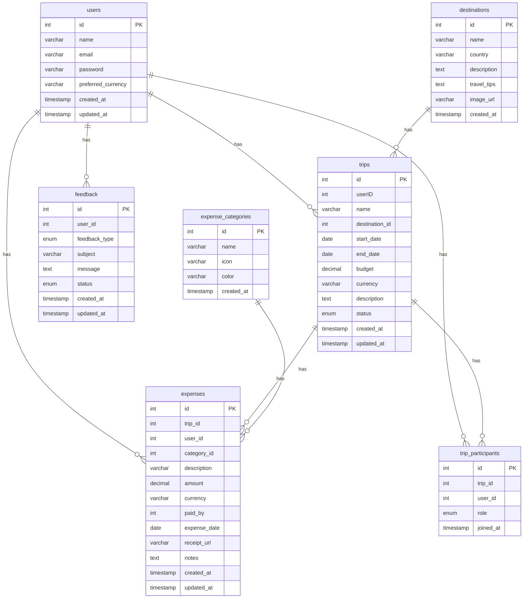
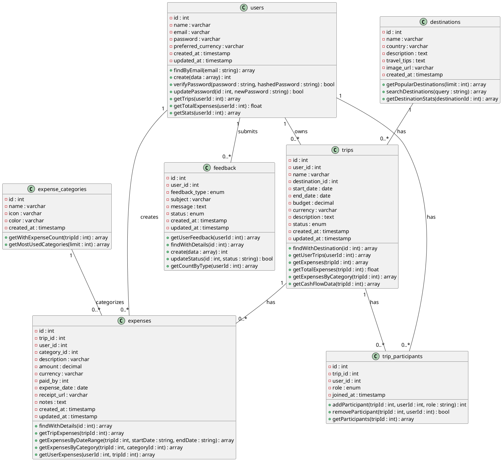
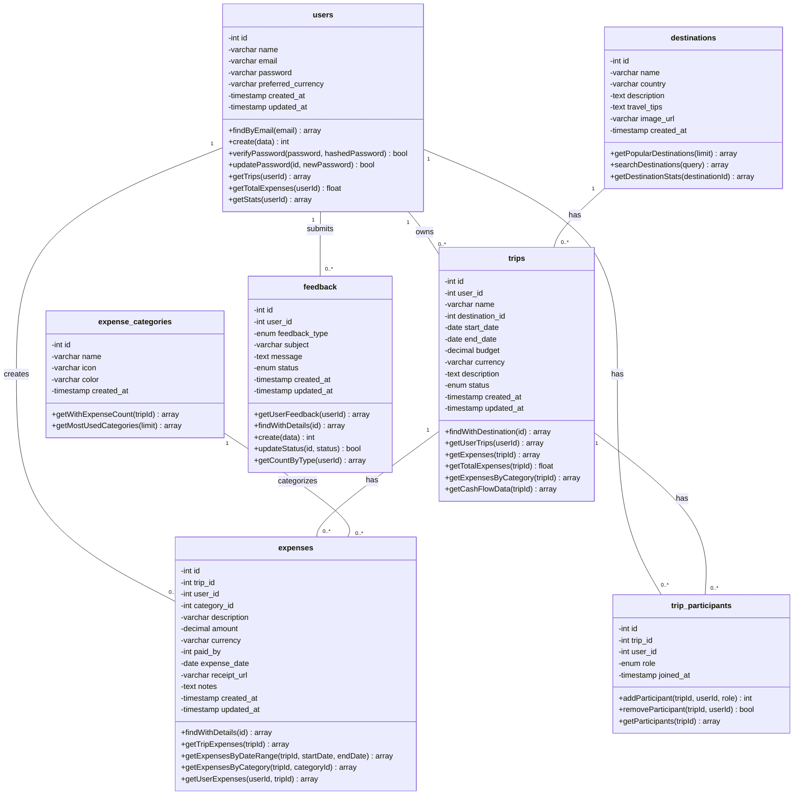

# WiseTravel2 - Entity Relationship Diagram

## Database Schema

## Alternative Format (Mermaid for GitHub/VS Code)

## Relationships Explained

### 1:N (One-to-Many) Relationships

- **users → trips**: One user can have many trips
- **users → expenses**: One user can create many expenses
- **users → trip_participants**: One user can participate in many trips
- **users → feedback**: One user can submit many feedback entries
- **destinations → trips**: One destination can be used in many trips
- **trips → expenses**: One trip can have many expenses
- **trips → trip_participants**: One trip can have many participants
- **expense_categories → expenses**: One category can be used in many expenses

## Table Descriptions

### users
Main user accounts with authentication and preferences.

### destinations
Popular travel destinations with descriptions and tips.

### trips
Travel trips planned or completed by users.

### expenses
Individual expenses tracked for each trip.

### expense_categories
Predefined categories for classifying expenses (food, transport, accommodation, etc.).

### trip_participants
Junction table linking users to trips they participate in (with roles: owner/participant).

### feedback
User feedback submissions (suggestions, questions, problems).

---

## Class Diagram (UML Style)

## Alternative: Mermaid Class Diagram (Larger Font)

---

## How to View

### For PlantUML:
1. Install PlantUML extension in VS Code
2. Or paste the PlantUML code into [PlantUML Online Editor](http://www.plantuml.com/plantuml/uml/)

### For Mermaid:
1. Install "Markdown Preview Mermaid Support" extension in VS Code
2. Or view on GitHub (renders automatically)
3. Or paste into [Mermaid Live Editor](https://mermaid.live)
